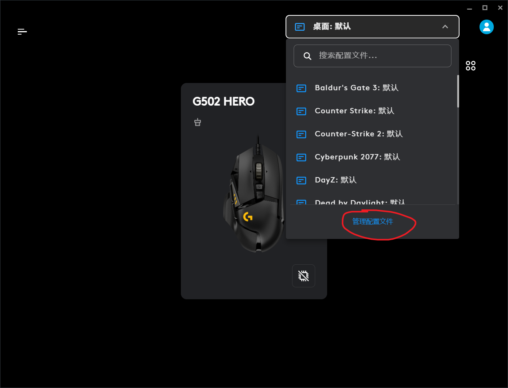
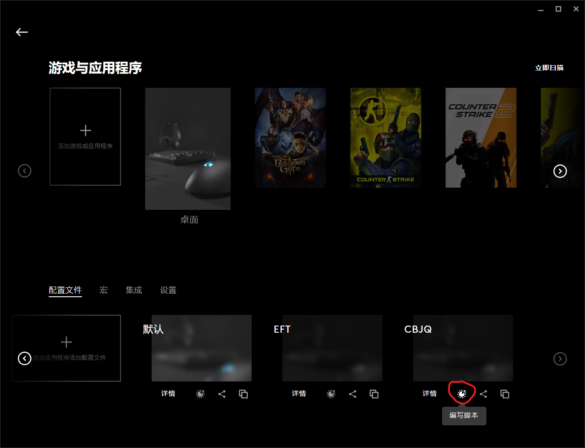
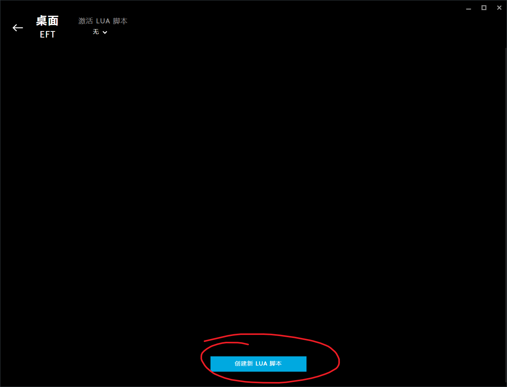
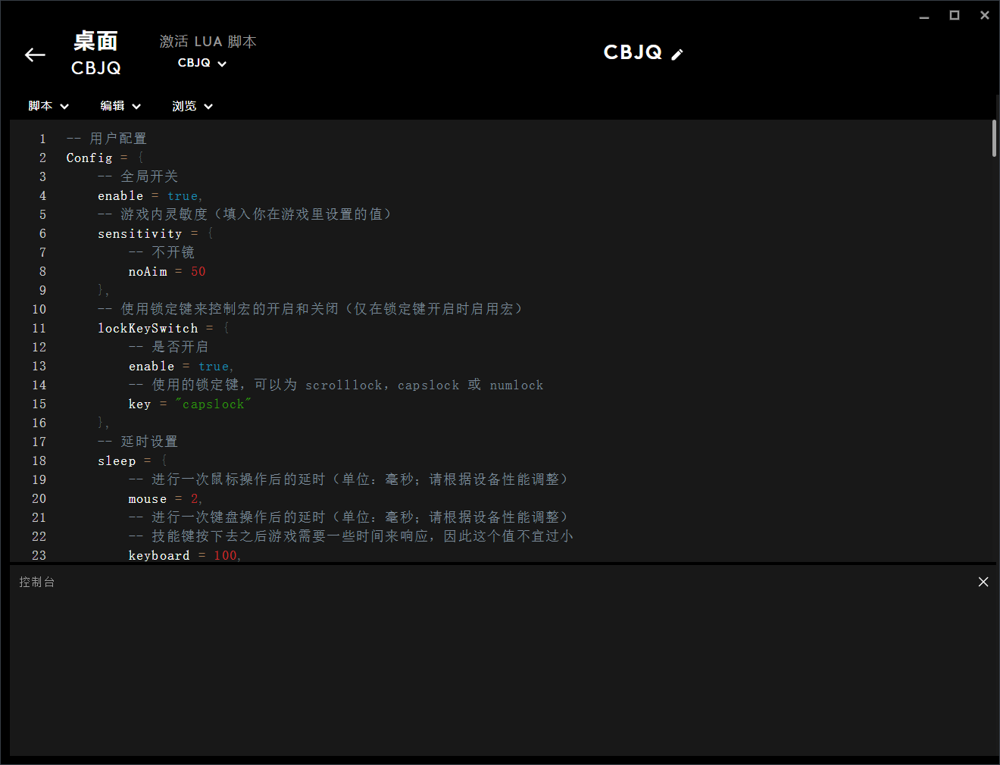

# snowbreak-logitech-macro

尘白禁区 - 罗技鼠标宏

## 环境要求

- 一个可编程的罗技鼠标
- Logitech G HUB 软件

## 功能

### 里芙-无限之视 E 技能一键开转

一键释放 E 技能，快速转圈给周围敌人挂上标记，最后自动接大招。

## 使用方法

1. 点击[main.lua](https://github.com/andywang425/snowbreak-logitech-macro/blob/master/main.lua)，ctrl+a 全选，然后复制全部代码。
2. 以管理员身份运行 G HUB，找到你玩尘白禁区时用的配置文件，点击编写脚本按钮。
   
   
3. 点击创建新 LUA 脚本。
   
4. 粘贴刚刚复制的代码。
5. 阅读脚本开头的用户配置部分，修改 Config 内的配置。
   
6. 在脚本编辑器内按 Ctrl+S 保存并运行脚本，此时控制台内会输出 LOADED，表示脚本已启用。

## 鸣谢

[Soldier76](https://github.com/kiccer/Soldier76)：PUBG - 罗技鼠标宏。从这个项目学到不少，感谢作者的分享！

## 免责声明

该脚本仅供学习交流，使用该脚本造成的任何后果均由使用者本人承担。
